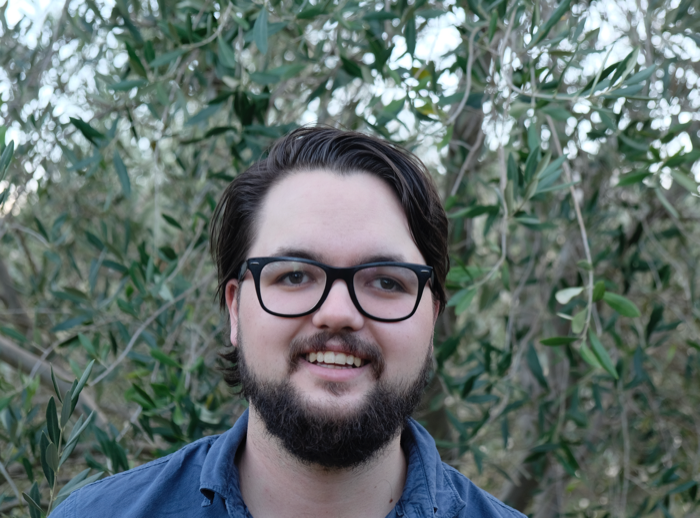

::: {.hero}
```{=html}

```

::: {.hero-body}
# Dr. Douglas A. Parry

::: {.hero-role}
Assistant Professor of Media Psychology, Vrije Universiteit Amsterdam, the Netherlands
:::

::: {.hero-affil}
External Associate Research Fellow, Department of Information Science, Stellenbosch University, South Africa<br>
External Associate Researcher, Methods Lab, Weizenbaum Institute for the Networked Society, Germany
:::

I study how adolescents and young adults use digital media, and what that means
for their cognition and well-being.

```{=html}
<div class="social-row">
  <a href="https://scholar.google.co.za/citations?user=EhrDFkYAAAAJ&hl=en" target="_blank" aria-label="Google Scholar"><i class="ai ai-google-scholar"></i></a>
  <a href="https://orcid.org/0000-0002-6443-3425" target="_blank" aria-label="ORCID"><i class="ai ai-orcid"></i></a>
  <a href="https://osf.io/sa5x4" target="_blank" aria-label="OSF"><i class="ai ai-osf"></i></a>
  <a href="https://www.researchgate.net/profile/Douglas_Parry" target="_blank" aria-label="ResearchGate"><i class="ai ai-researchgate"></i></a>
  <a href="https://github.com/dougaparry" target="_blank" aria-label="GitHub"><i class="bi bi-github"></i></a>
  <a href="https://www.linkedin.com/in/dougaparry/" target="_blank" aria-label="LinkedIn"><i class="bi bi-linkedin"></i></a>
  <a href="https://bsky.app/profile/dougaparry.bsky.social" target="_blank" aria-label="Bluesky"><i class="bi bi-bluesky"></i></a>
  <a href="mailto:d.a.parry@vu.nl" aria-label="Email"><i class="bi bi-envelope-fill"></i></a>
</div>
```
:::
:::

## About my research

My research focuses on how adolescents and young adults engage with digital
media, the cognitive and psychological effects of this engagement, and the
competencies they need to navigate digital environments effectively.
Specifically, I study how digital media use influences attention, mental
health, and cognitive control, drawing on experimental, experience sampling,
and computational tracking methods.

My work also extends to digital well-being, where I investigate both the
narratives around media effects and the effectiveness of strategies, both
behavioural and technological, for mitigating harms and enhancing benefits. A
central thread is understanding the digital competencies that enable people to
thrive in a technology-driven world. Beyond self-regulation and digital
well-being, these include digital literacy, and the ability to
critically engage with increasingly complex digital ecosystems. Running through
all of it is the development, analysis, and use of digital trace data
techniques to better capture real-world media use and its effects over time.

I'm an advocate of mixed methods, and I routinely combine quantitative,
qualitative, and computational approaches. I also have experience with
systematic reviews and meta-analyses. I follow open science
practices, and wherever possible, my materials, data, and analyses are publicly
available.

My research has appeared in leading journals across communication science and
related fields, including *Nature Human Behaviour*; the *Journal of
Communication*; *Technology, Mind and Behaviour*; *JAMA Pediatrics*; *Media
Psychology*; the *Journal of Psychopathology and Clinical Science*; *Computers & Education*; *Behaviour Research
Methods*; and *Computers in Human Behaviour*.

You can browse my [publications](publications.qmd) or grab my
[CV](files/curriculum_vitae.pdf).

## Get in touch

Have a question or want to collaborate? I'd love to hear from you.
[Send me an email](mailto:d.a.parry@vu.nl).
